# 乐动网球小程序｜当前页面设计文档

> 文档基线：2026-08-29  
> 项目版本：开发者工具运行态显示 v3.1.7  
> 采集环境：微信开发者工具，逻辑视口约 390 × 671，PNG 为 2× 输出  
> 采集账号：已登录会员，同时具备管理员、特殊管理员、畅打管理员、账户管理员和教练权限  
> 文档性质：当前实现盘点，不代表目标方案

## 1. 产品概览

小程序围绕三个核心业务展开：场地预约、畅打活动、会员账户。当前共注册 14 个页面，其中 4 个为底部主导航页面，10 个为详情、记录、管理或教练工作流页面。

底部主导航由 app.json 定义：

| 顺序 | 页面 | 文案 | 选中色 |
| --- | --- | --- | --- |
| 1 | 首页 | 首页 | <code>#1296db</code> |
| 2 | 场地预约 | 场地预订 | <code>#1296db</code> |
| 3 | 畅打 | 畅打 | <code>#1296db</code> |
| 4 | 会员中心 | 会员中心 | <code>#1296db</code> |

说明：自动化截图只包含小程序页面内容层，不包含开发者工具外壳和原生 tabBar；tabBar 信息以运行配置为准。

## 2. 信息架构与跳转关系

~~~mermaid
flowchart TD
  I[首页] -->|选择麓坊/桐梓林/雅居乐| B[场地预约]
  I -->|特殊管理员点击版本号| OD[订单展示]

  B -->|点击畅打占用时段| RD[畅打详情]
  B -->|点击普通已预订时段| MO[我的预约]
  B -->|未登录下单| M[会员中心/登录]

  R[畅打] -->|活动卡片/立即报名| RD
  RD -->|未登录报名，登录后回跳| M
  M -->|登录完成| RD

  M --> MO
  M --> CL[充值记录]
  M --> SL[消费记录]
  M -->|账户管理员| AS[账户查询]
  M -->|教练| CC[教练填报]

  CC -->|新增填报：课程| CCF[课程表单]
  CC -->|修改待审课程| CCF
  CC -->|新增填报：用户充值| RNF[充值待办表单]
  CC -->|修改充值待办| RNF

  MR[月度缴费汇总]:::orphan

  classDef orphan fill:#fff3cd,stroke:#f59e0b,color:#92400e;
~~~

补充关系：

- 首页校区快捷入口先写入全局 selectedCampus，再通过 switchTab 进入场地预约。
- 场地预约中的已占用格子是条件入口：畅打占用跳转畅打详情，普通订单跳转我的预约并携带 targetCourtId 定位目标订单。
- 畅打详情需要 rushId；从列表进入是正常路径，直接打开无参数时为空白内容态。
- 订单展示没有可见菜单入口；特殊管理员点击首页底部版本号后进入。
- 月度缴费汇总已注册路由且有权限校验，但当前源码中未发现应用内入口，属于孤立页面。

## 3. 角色与权限

| 角色/身份 | 可见或可执行能力 |
| --- | --- |
| 游客 | 浏览首页、预约表、畅打列表与详情；下单或报名时进入登录流程 |
| 已登录会员 | 查看会员卡、我的预约、充值记录、消费记录；预约、支付、报名、退款受业务规则约束 |
| VIP | 预约提前天数与畅打价格存在差异；详情页展示 VIP/非会员价格 |
| 管理员 | 月度缴费汇总；部分订单、畅打整场取消与预约范围能力 |
| 特殊管理员 | 通过首页版本号进入全部订单展示，并可发起管理员退款流程 |
| 畅打管理员 | 在场地预约页可“发起畅打”，在畅打业务中拥有管理能力 |
| 账户管理员 | 会员中心显示“账户查询”入口 |
| 教练 | 会员中心显示“教练填报”，可维护待审课程与充值待办 |

权限来源包括 managerList、specialManagerList、courtRushManagerList、accountManagerList 和 coachContext。当前 UI 主要通过条件显示隐藏入口，页面自身仍会再次校验关键权限。

## 4. 页面总表

| 页面 | 路由 | 当前截图状态 | 核心动作 |
| --- | --- | --- | --- |
| 首页 | <code>pages/index/index</code> | 公告真实数据态 | 选择校区、进入预约、特殊管理员入口 |
| 场地预约 | <code>pages/booking/booking</code> | 麓坊当日真实排期 | 切校区/日期、选时段、下单、发起畅打、查看地图 |
| 畅打 | <code>pages/rush/rush</code> | 20 条活动真实列表 | 查看详情/报名、分页 |
| 畅打详情 | <code>pages/rushDetail/rushDetail</code> | 已满活动真实详情 | 报名/支付/取消/退款/整场取消 |
| 会员中心 | <code>pages/member/member</code> | 已登录会员、管理员、教练态 | 查看账户信息与业务入口 |
| 账户查询 | <code>pages/accountSearch/accountSearch</code> | 初始表单态 | 姓名/电话前缀查询、清空 |
| 我的预约 | <code>pages/myOrder/orderlist</code> | 当前账号空态 | 支付、取消、退款、分页、目标订单定位 |
| 订单展示 | <code>pages/orderDisplay/orderDisplay</code> | 特殊管理员真实列表 | 查看全部订单、管理员退款、分页 |
| 充值记录 | <code>pages/chargedList/chargedList</code> | 12 条真实记录 | 浏览、分页、下拉刷新 |
| 消费记录 | <code>pages/spendList/spendList</code> | 2 条真实记录 | 浏览、分页、下拉刷新 |
| 月度缴费汇总 | <code>pages/monthlyRevenue/monthlyRevenue</code> | 管理员空态 | 月份/校区汇总、下拉刷新 |
| 教练填报 | <code>pages/coachCourse/coachCourse</code> | 待处理空态 | 新增、切换三类记录、修改/删除、分页 |
| 课程表单 | <code>pages/coachCourseForm/coachCourseForm</code> | 新建初始态 | 填课程、会员、扣费信息并提交待审 |
| 充值待办表单 | <code>pages/rechargeNoticeForm/rechargeNoticeForm</code> | 运行时白屏 | 设计上应选会员、填备注并提交；当前无法渲染 |

## 5. 页面设计详述

### 5.1 首页

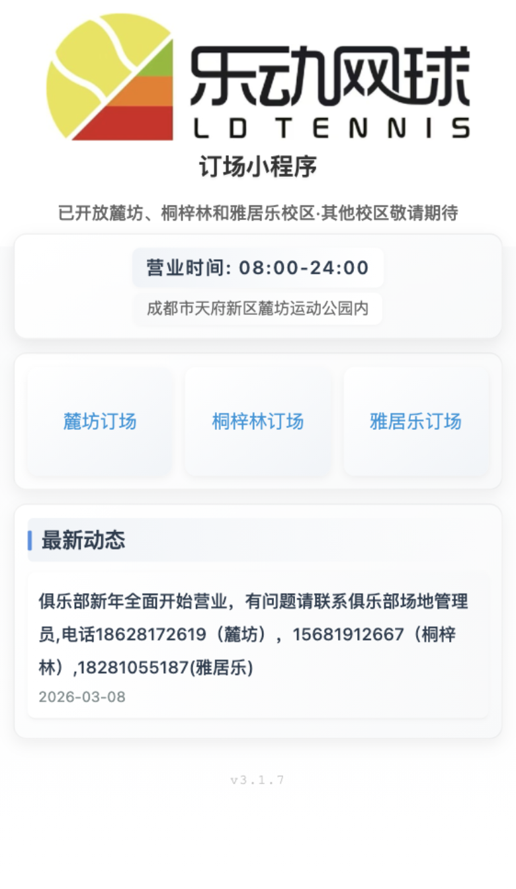

- 页面结构：品牌图与副标题、营业信息、三校区快捷入口、最新动态、版本号。
- 主任务：尽快进入指定校区预约。校区卡片是等权快捷入口。
- 动态数据：公告内容与日期；版本号来自小程序账户信息，失败时回退为 3.1.7。
- 隐藏动作：版本号对特殊管理员是订单展示入口；普通用户点击无反馈。
- 当前特征：首页地址固定为麓坊运动公园，但快捷入口覆盖三个校区，信息语义并不完全一致。

### 5.2 场地预约

  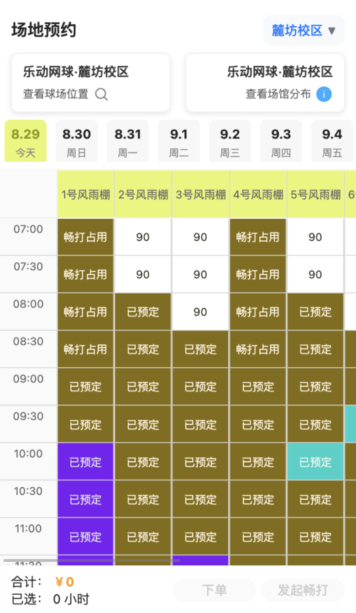
  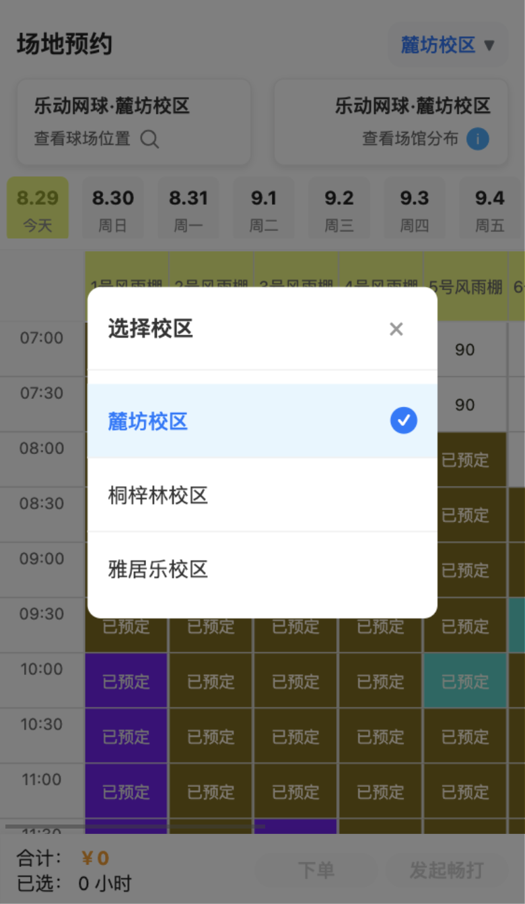
  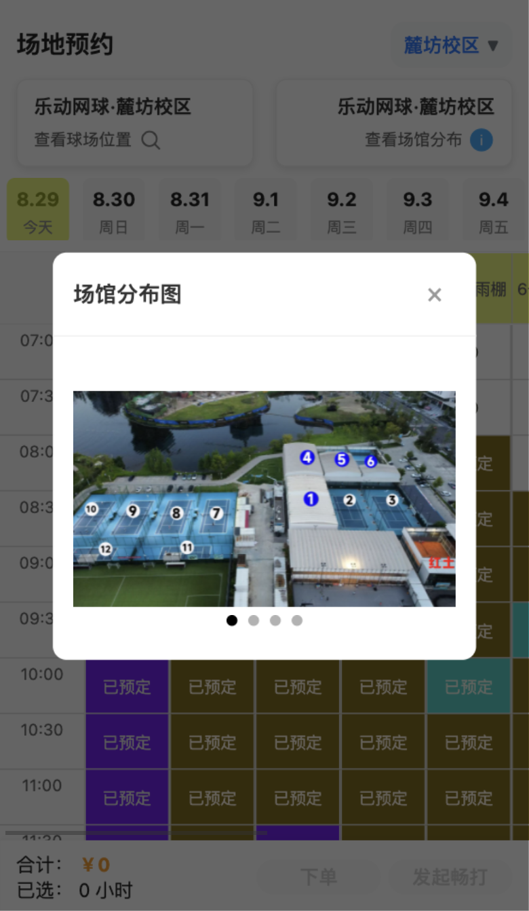

- 页面结构：固定头部、校区选择、位置/场馆分布入口、14 天日期条、横向球场 × 纵向半小时的二维排期表、固定结算栏。
- 排期范围：当前麓坊校区显示 11 片场地；时间从 07:00 至 23:30。
- 单元格状态：可订价格、已预订、畅打占用、本人/他人/管理员/VIP 等颜色状态；当前页面没有状态图例。
- 主动作：选中一个或多个半小时格后计算总时长和总价；普通用户下单，畅打管理员可发起畅打。
- 已占用格的行为不是纯禁用：点击后会跳转对应畅打详情或我的预约。
- 弹层：校区选择、场馆分布轮播、支付提醒。支付提醒强调 24 小时内不可取消、人数与商业活动规则。
- 交互风险：页面同时需要横向和纵向浏览，右侧场地天然被裁切；颜色承担了过多状态表达。

### 5.3 畅打列表

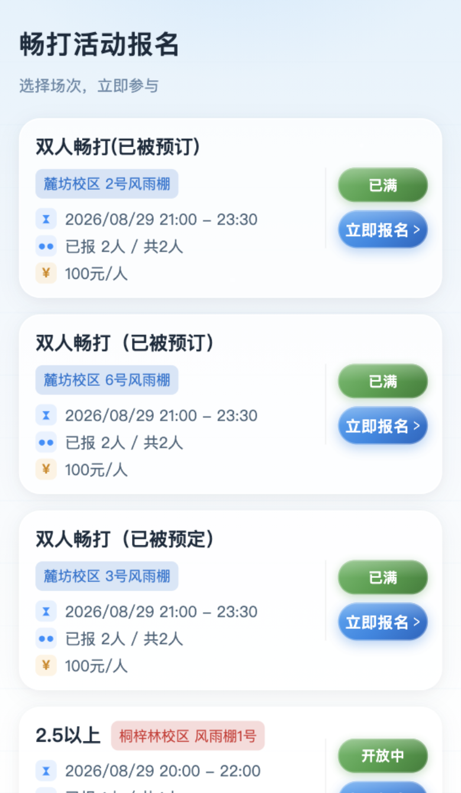

- 页面结构：蓝色氛围背景、活动卡片列表、底部分页。
- 卡片字段：标题、校区和场地、日期时间、已报名/容量、单价、状态、行动按钮。
- 状态：开放中、已满、进行中、已结束；已结束卡片弱化，按钮文案切为“查看详情”。
- 当前数据态：首屏含已满和开放中活动，单页最多 20 条。
- 视觉上比其他页面使用更多渐变、发光、玻璃质感与彩色标签，是当前产品中风格最强的一组页面。

### 5.4 畅打详情

  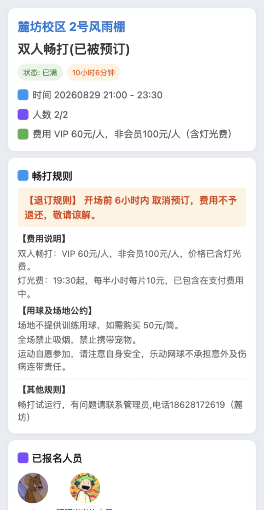
  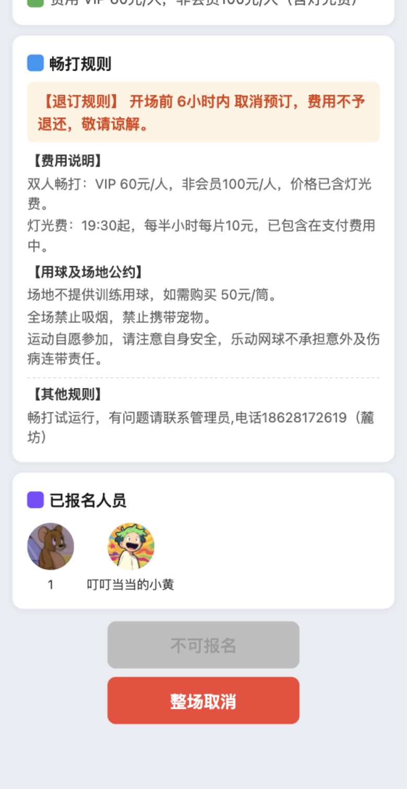

- 信息层级：活动概览 → 规则 → 已报名人员 → 条件动作。
- 概览字段：校区/场地、活动标题、状态、开场倒计时、时间、人数、会员/非会员费用。
- 规则：6 小时退订规则、费用与灯光费、用球与场地公约、管理员补充规则。
- 报名人员：头像与昵称；管理员点击参与者可查看更详细信息。
- 条件动作：报名、继续支付、取消未支付报名、取消并退款、整场取消。按钮随登录、支付、人数、时间和管理权限变化。
- 当前截图为已满活动，普通报名按钮禁用，管理员可见“整场取消”。

### 5.5 会员中心

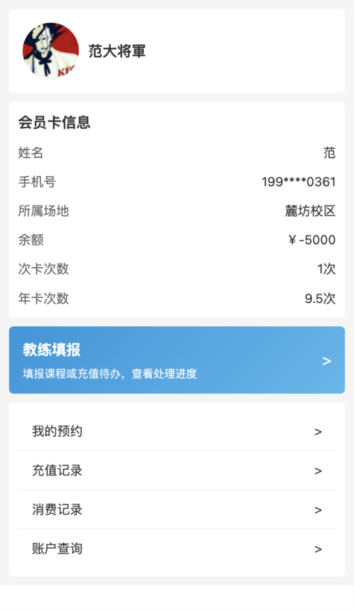

- 已登录态：头像/昵称、会员姓名、脱敏手机号、所属校区、余额、次卡、年卡。
- 未登录态：显示登录/注册按钮；手机号授权后还需选择头像并填写昵称，完成资料后才结束登录。
- 菜单：我的预约；存在会员信息时显示充值记录、消费记录；账户管理员额外显示账户查询；教练额外显示大号“教练填报”入口。
- 当前截图中账户余额为负数，但样式与普通余额一致，没有欠费语义提示。

### 5.6 账户查询

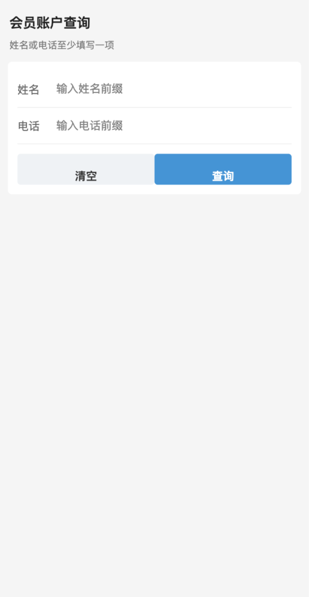

- 账户管理员专用。
- 查询条件为姓名前缀和电话前缀，至少填写一项。
- 结果态包括加载、错误、无结果和账户卡片列表；初始态保持留白，不显示提示卡。
- 操作为清空与查询，主次按钮并排等宽。

### 5.7 我的预约与全部订单

  
  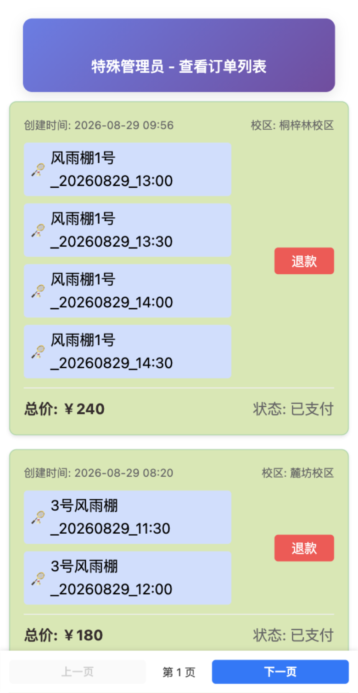

我的预约：

- 卡片区分普通订场和畅打订单，显示校区、场地、时间、金额、状态。
- 条件动作包括继续支付、取消、退款；管理员身份会隐藏部分个人支付/退款动作。
- 支持通过预约表传入 targetCourtId，加载后定位和高亮对应订单。
- 当前账号返回空列表，仅显示“没有更多数据了”和禁用分页；缺少明确的空态标题、说明与返回预约 CTA。

全部订单：

- 特殊管理员页面，首屏 20 条，绿色已支付卡片、紫色渐变页头、红色退款按钮。
- 管理员退款使用密码弹层，展示订单号和金额，确认后调用退款流程。
- 场地 ID 直接按底层字符串换行展示，日期和时间的可读性偏低。

### 5.8 充值记录与消费记录

  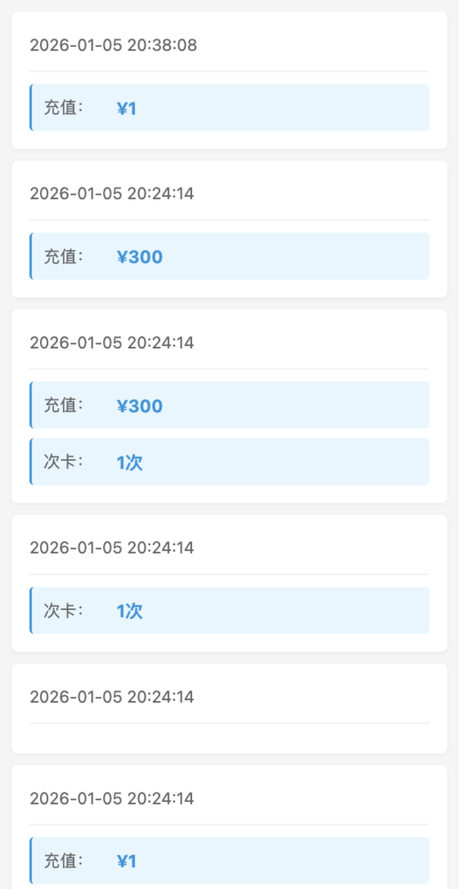
  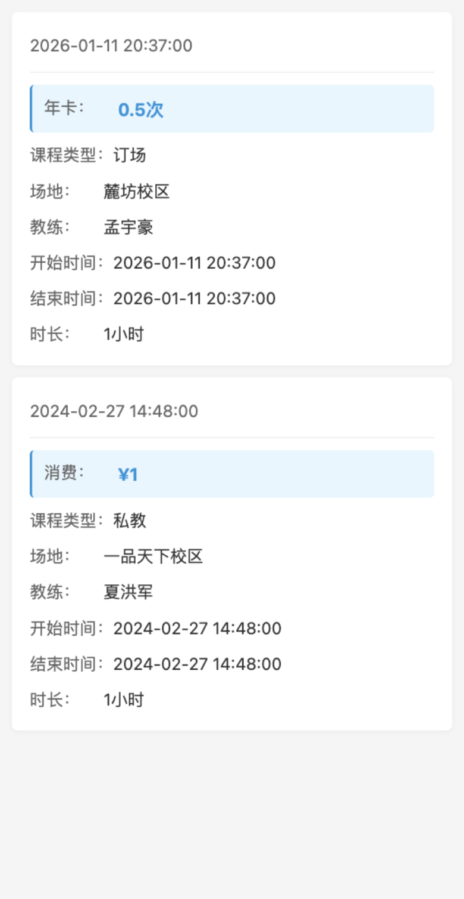

- 两页共用白色卡片、浅蓝强调行、浅灰背景与分页模式。
- 充值记录可同时展示余额充值、次卡和年卡；当前数据中存在字段全部为零的空卡片。
- 消费记录展示扣余额/次卡/年卡、课程类型、场地、教练、开始/结束时间与时长。
- 两页都具备加载、空、数据、分页和下拉刷新状态。

### 5.9 月度缴费汇总

- 管理员专用，设计上按月份列出各校区“定场/畅打/小计”，末尾显示全部总计。
- 当前运行数据为空，首次加载约 30 秒后进入“暂无缴费数据”。加载期间没有超时或重试入口。
- 当前应用内无入口；只能通过直接路由、开发者工具或未来新增入口访问。

### 5.10 教练填报

- 顶部主按钮“新增填报”，点击后通过动作表选择“课程”或“用户充值”。
- 三个标签：待处理、正式课、已知悉充值。
- 待处理把课程与充值待办合并展示，支持修改、删除与明细折叠；允许部分接口失败时保留已加载数据。
- 正式课提供当月课程数、总时长、等效总人数，并支持近三个月分页。
- 已知悉充值明确说明“知悉不等于已完成真实充值”，修改后会重新进入待处理。
- 当前截图为待处理空态。

### 5.11 课程表单

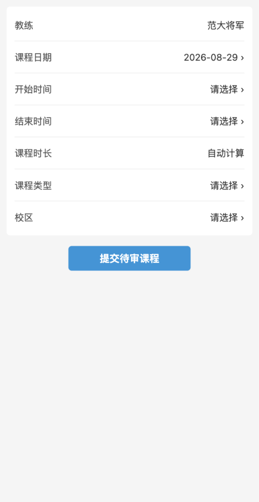

- 基础信息按顺序逐步解锁：日期 → 开始时间 → 结束时间 → 自动计算时长 → 课程类型 → 成人/儿童 → 校区。
- 课程类型包括体验课未成单、体验课成单、订场、班课、私教。
- 非体验课可搜索会员并填写扣费方式、金额/次数、折算金额、数量；检测到欠费时提示但不阻止提交。
- 支持新建和编辑两种模式；编辑通过事件通道接收原记录。
- 当前截图为新建初始态，后续会员与扣费区域尚未出现。

### 5.12 充值待办表单

设计意图：展示教练与系统生成的充值日期，搜索并选择会员，填写最多 500 字充值备注，提交给管理员知悉；该操作不会直接修改正式充值记录。

当前运行结果是白屏。开发者工具异常为：

> pages/rechargeNoticeForm/rechargeNoticeForm.js 被代码依赖分析忽略，无法被其他模块引用。

因此“教练填报 → 新增填报 → 用户充值”和“修改充值待办”两个路径目前不可用。截图保留真实故障态。

## 6. 当前视觉系统

### 6.1 基础令牌

| 类别 | 当前常用值 | 用途 |
| --- | --- | --- |
| 品牌/主操作色 | <code>#1296db</code> | tabBar 选中、按钮、强调文字 |
| 微信/成功色 | <code>#07c160</code>、<code>#2e7d32</code> | 成功、开放、状态标签 |
| 危险色 | <code>#ff4d4f</code>、<code>#dc2626</code> | 退款、删除、取消 |
| 主文字 | <code>#333</code> | 标题与正文 |
| 次文字 | <code>#666</code>、<code>#999</code> | 标签、说明、空态 |
| 页面背景 | <code>#f5f5f5</code>、<code>#f6f6f6</code> | 多数列表与表单页 |
| 卡片 | <code>#fff</code> | 内容容器 |
| 场地预约强调 | <code>#e9f56e</code> | 日期选中、球场表头 |
| 畅打强调 | 蓝/绿/紫渐变 | 活动状态、CTA、校区标签 |

字号主要集中在 24–32rpx；页面大标题多为 36–44rpx。圆角常见 8rpx、10rpx、20rpx，但源码中存在 px/rpx 混用。卡片阴影多为低透明度黑色 0 2rpx 8rpx。

### 6.2 组件模式

- 白色卡片：会员、记录、教练表单、畅打详情。
- 固定底栏：场地预约结算；订单列表分页。
- 条件主按钮：报名/支付/退款/取消、课程提交。
- 遮罩弹层：校区、场馆分布、支付提示、订单取消理由、管理员退款、参与者详情、资料补全。
- 状态反馈：加载文字、空态文字、toast；仅部分页面有局部错误和重试语义。

### 6.3 一致性现状

基础页面以蓝色 + 白卡 + 浅灰背景为主，但场地预约、畅打和订单展示形成了三套明显不同的视觉语言：

- 场地预约：高密度表格、荧光黄与多种状态色。
- 畅打：渐变、光泽、玻璃感和彩色图形。
- 订单展示：紫色渐变页头、浅绿卡片、浅蓝场地模块。

功能可以区分，但品牌统一性、颜色语义和组件复用度较弱。

## 7. 必要状态与交互清单

后续设计或重构时，至少需要保留以下状态：

- 身份：游客、资料待补全、普通会员、VIP、各管理员、教练。
- 网络：首次加载、局部加载、失败、部分成功、下拉刷新。
- 数据：无数据、单页、分页末尾、目标项定位。
- 预约格：可选、已选、普通已订、本人已订、管理员占用、VIP 占用、畅打占用、锁定。
- 畅打：开放、已满、进行中、已结束、待支付、已报名、可退款、不可退款、整场取消中。
- 表单：逐步解锁、搜索中、无搜索结果、会员已选择、会员失效、欠费提示、提交中、并发版本失效。
- 高风险动作：取消订单、退款、删除待审记录、整场取消，均需明确确认和结果反馈。

## 8. 观察到的问题与优先级

| 优先级 | 问题 | 影响 |
| --- | --- | --- |
| P0 | 充值待办 JS 被依赖分析过滤，页面白屏 | 教练无法新增或修改充值待办，完整业务路径中断 |
| P1 | 月度缴费汇总没有应用内入口 | 已实现能力不可发现、不可正常到达 |
| P1 | 特殊管理员入口隐藏在版本号 | 权限功能难发现，也缺少入口说明与无权限反馈 |
| P1 | 预约表依赖多种颜色但没有图例 | 新用户难理解状态，色觉无障碍风险较高 |
| P1 | 三套主要业务视觉语言差异大 | 品牌一致性与组件复用不足 |
| P2 | 我的预约空态只有“没有更多数据了” | 缺少语义说明和“去预约”引导 |
| P2 | 订单展示直接显示底层场地 ID | 日期时间难读，卡片内容换行拥挤 |
| P2 | 月度汇总空数据前加载时间长，页面无超时/重试 | 用户可能误认为卡死 |
| P2 | 充值记录存在无金额、无次数的空卡片 | 数据异常没有过滤或解释 |
| P2 | 会员负余额没有欠费视觉语义 | 重要账户状态容易被忽略 |
| P2 | 首页地址固定为麓坊，但页面支持三校区 | 信息范围与实际能力不一致 |
| P2 | 畅打详情日期格式为 YYYYMMDD | 与列表 YYYY/MM/DD 不一致，可读性降低 |

## 9. 截图索引

全部运行时截图位于：<code>docs/assets/current-ui-2026-08-29/</code>。

共 14 个注册页面截图，另含 3 个关键交互状态：校区选择、场馆分布、畅打详情底部操作区。截图中的个人信息来自当前开发环境；手机号在会员中心已按页面逻辑脱敏。文档与图片适合保留在项目内部，不建议直接公开发布。
